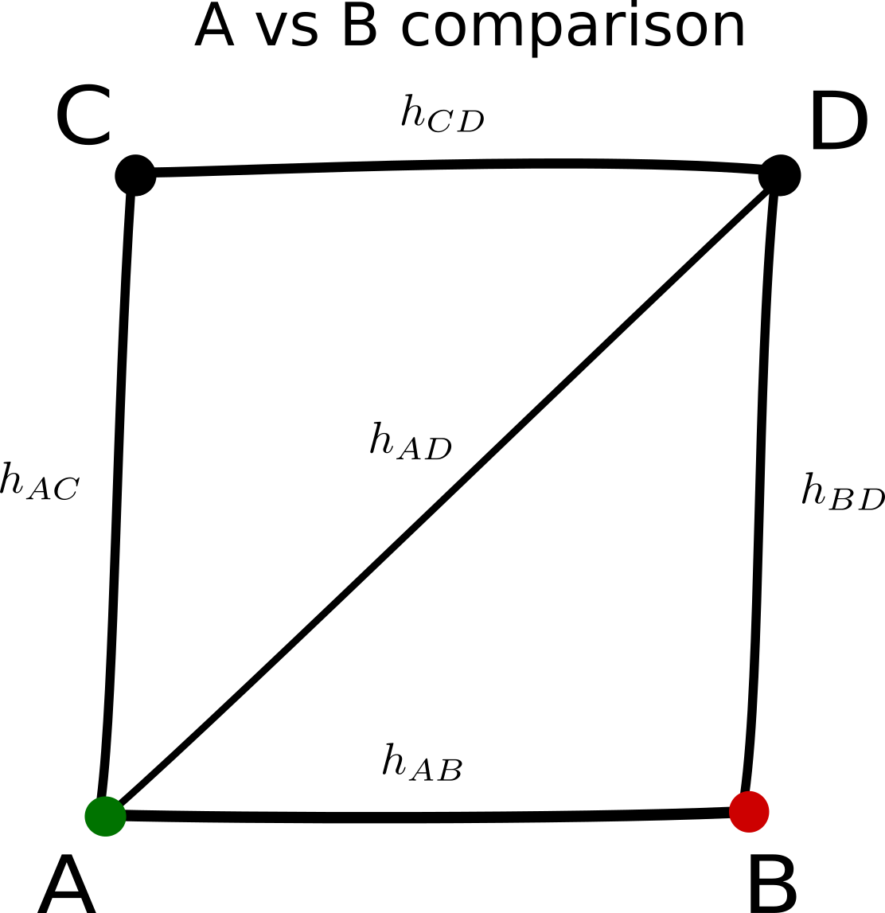

projection $\mathbf{H}$ matrix

- Resembles the **hat matrix** in a linear regression model
- Dimensions: $C \times D$, $C$: comparisons, $D$: comparisons with studies
- Each row $h\_{AB}$ refers to a single comparison - $AB$

$ \hat{\theta}\_{AB}^N = h\_{AB}^{AB} \hat{\theta}\_{AB} + h\_{AC}^{AB} \hat{\theta}\_{AC} + h\_{AD}^{AB} \hat{\theta}\_{AD} + h\_{BD}^{AB} \hat{\theta}\_{BD} + h\_{CD}^{AB} \hat{\theta}\_{CD} $

<table>
<tr>
<td class="vm">
<ul>
<li>
In general $\sum h\_{XY}^{AB} \neq 1$
</li>
<li>
$h\_{XY}^{AB} = - h\_{YX}^{AB}$
</li>
<li>
$\sum\_{i=1}^n h\_{AX}^{AB} = 1$
</li>
<li>
$\sum\_{i=1}^n h\_{XB}^{AB} = 1$
</li>
<li>
$ \forall Z \notin \\{A, B \\} \sum h\_{XB}^{AB} = 1$
</li>
</ul>
</td>
<td>

</td>
</tr>
</table>

<footer>
Theodore Papakonstantinou - ISCB 2018 - 3
</footer>
