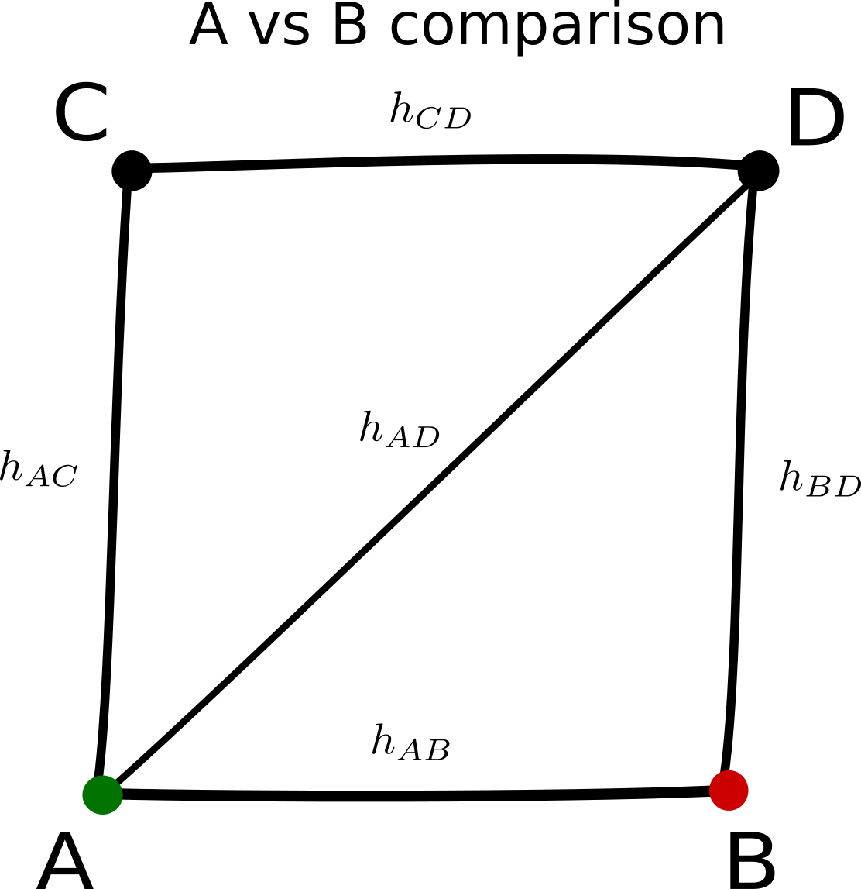

projection $\mathbf{H}$ matrix

- Resembles the **hat matrix** in a linear regression model
- Each row $h\_{AB}$ refers to a single comparison

$ \hat{\theta}\_{AB}^N = h\_{AB}^{AB} \hat{\theta}\_{AB} + h\_{AC}^{AB} \hat{\theta}\_{AC} + h\_{AD}^{AB} \hat{\theta}\_{AD} + h\_{BD}^{AB} \hat{\theta}\_{BD} + h\_{CD}^{AB} \hat{\theta}\_{CD} $

The elements of hatmatrix can be seen as generalization of weights in pairwise meta-analysis 
**but** they do not add up to $1$ 
$\sum h\_{XY}^{AB} \neq 1$ and are not
strictly positive since $h\_{XY}^{AB} = - h\_{YX}^{AB}$.

<small> 
superscript $AB$ denoting the comparison is omitted
</small>

<footer>
Theodore Papakonstantinou - ISCB 2018 - 3b
</footer>
