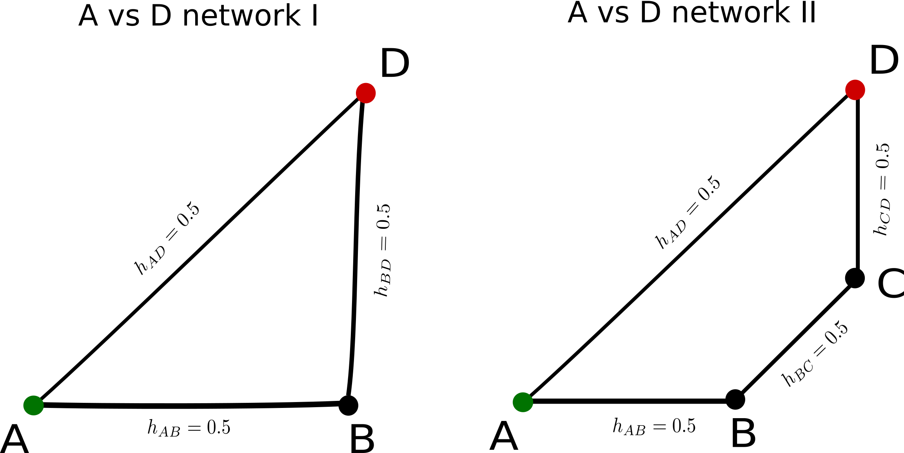

No easy fix 

Naive normalization: $c\_{XY} = \frac{|h\_{XY}|}{\sum_i |h\_i|}$

Contribution should be **independent** for parallel comparisons.

> In both networks I and II contribution should be equal 
> but normalisation in network I gives:
> $c\_{AD}= \frac{1}{3}$
> and in network II gives:
> $c\_{AD}= \frac{1}{4}$

contribution of direct should be: $c\_{direct}=h\_{direct}=1-h\_{indirect}$

<footer>
Theodore Papakonstantinou - ISCB 2018 - 4
</footer>
