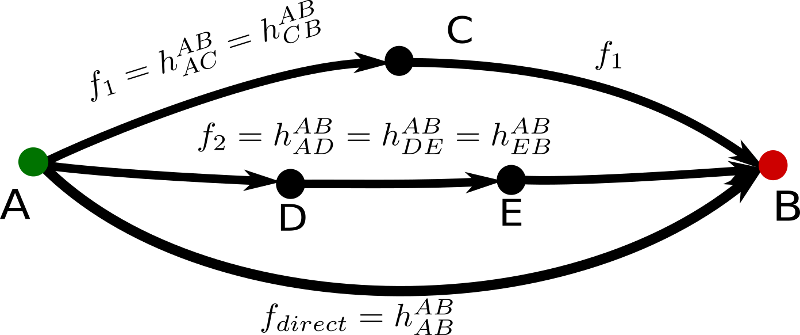

Basic Assumptions

### From $h$ matrix to graph $G$
- Each comparison ($h$ matrix row, $h\_{AB}$) can be transformed into a directed graph
$G_{AB}= (V,E, F)$ where the **flow** ($f$) of the edge is the value of the corresponding element in $h$ matrix.
- From the properties of $h$ follows that $f$ is a valid flow since flow is preserved in internal nodes $\sum\_{XZ \in E} f\_{XZ} = \sum\_{ZX \in E} f\_{ZX}, Z \notin \\{A,B\\}$

 
<table>
<tr><!-- .element: class="fragment" data-fragment-index="1" -->
<td>
Contribution of <em>parallel</em> paths (sequence of edges-comparisons)
 
 The contribution of a parallel-indipendent paths is **equal to the their flow**.
 
  $c\_{ACB}=c\_{AC}+c\_{CB} =f\_1$
 
  $c\_{ADB}=c\_{AD}+c\_{DB} =f\_2$
 
  $c\_{AEFB}=c\_{AE}+c\_{EF}+c\_{FB} =f\_3$
 
  $c\_{AB}=f\_{direct}$
</td>
<td>

</td>
</tr>
<tr><!-- .element: class="fragment" data-fragment-index="2" -->
<td>
Contribution of individual edge inside a path 
 
Each comparison **contributes equally** in a path so the contribution
  of each comparison is its **flow** divided by its **length**:
 
  $c\_{AC}=c\_{CD}=c\_{DB}=\frac{f\_{ACDB}}{3}$
 
  $\mathbf{c\_{comparison}=\frac{f\_{path}}{length \~ of \~ path}}$
</td>
<td>

</td>
</tr>
</table>

<footer>
Theodore Papakonstantinou - ISCB 2018 - 5
</footer>
