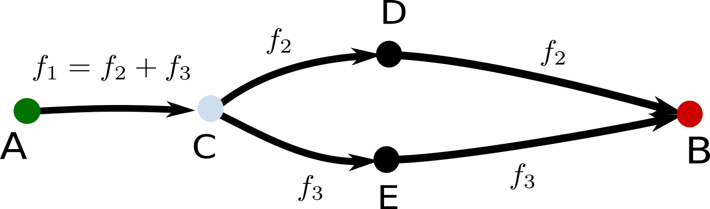
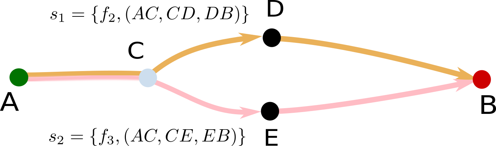

Streams

<table>
<tr>
<td>
Mixed paths 
 
A comparison (edge) is shared between two parallel paths.
</td>
<td>

</td>
</tr>
<tr><!-- .element: class="fragment" data-fragment-index="1" -->
<td>
Decompose flow into **streams**
 
A stream is defined by its flow $\phi$ and the path $\pi$
 
$s\_i = \\{ \phi\_i, \pi\_i \\}$
 
Total contribution of a comparison is the sum over the streams that contain 
 
$\mathbf{c\_{x}=\sum\_{i, x \in i}\frac{f\_{i}}{l}, i \in \pi}$
 
$c\_{AC}=\frac{f\_2}{3}+\frac{f\_3}{3}$
</td>
<td>

</td>
</tr>
</table>

<footer>
Theodore Papakonstantinou - ISCB 2018 - 6
</footer>
