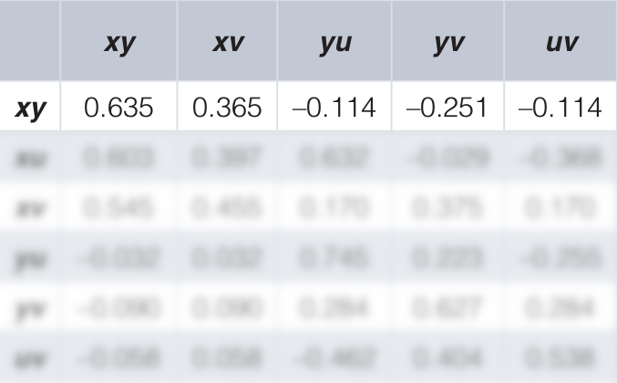
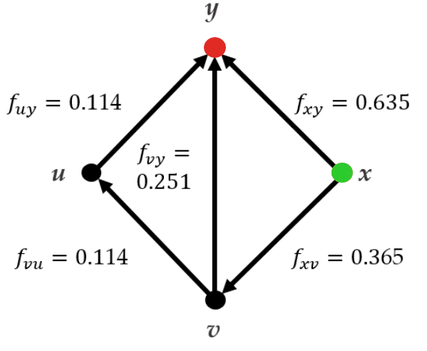

Example: Topical antibiotics without steroids for 
chronically discharging ears with underlying eardrum perforations.

Macfadyen CA, Acuin JM, Gamble C: Cochrane Database Syst Rev. 2005; (4): CD004618.  

**x**: no treatment, **y**: quinolone antibiotic, **u**: non-quinolone

comparison $x:y$

<footer>
Theodore Papakonstantinou - ISCB 2018 - 8
</footer>
