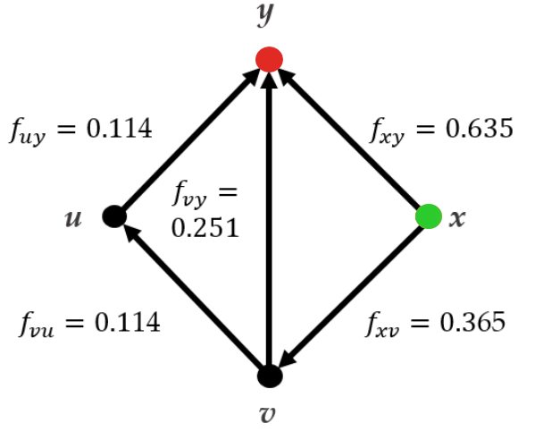
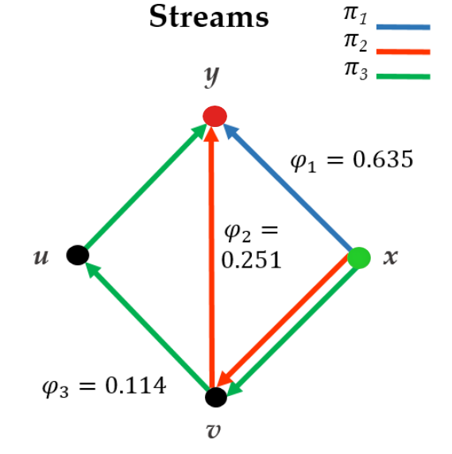

Example: Topical antibiotics without steroids for 
chronically discharging ears with underlying eardrum perforations.

Macfadyen CA, Acuin JM, Gamble C: Cochrane Database Syst Rev. 2005; (4): CD004618.  

**x**: no treatment, **y**: quinolone antibiotic, **u**: non-quinolone
antibiotic, **v**: antiseptic

comparison $x:y$

<!-- .element: class="fragment" data-fragment-index="1" -->
- $c\_{xy} = \phi\_1 = 0.635$<!-- .element: class="fragment" data-fragment-index="2" -->
- $c\_{vy} = \frac{\phi\_2}{2} = \frac{0.251}{2} = 0.126$<!-- .element: class="fragment" data-fragment-index="2" -->
- $c\_{xv} = \frac{\phi\_2}{2} + \frac{\phi\_3}{3}  = \frac{0.251}{2} +  \frac{0.114}{3} = 0.164$<!-- .element: class="fragment" data-fragment-index="2" -->
- $c\_{vu} = c\_{uy}  = \frac{\phi\_3}{3} = \frac{0.114}{3} = 0.038$<!-- .element: class="fragment" data-fragment-index="2" -->

<footer>
Theodore Papakonstantinou - ISCB 2018 - 8
</footer>
